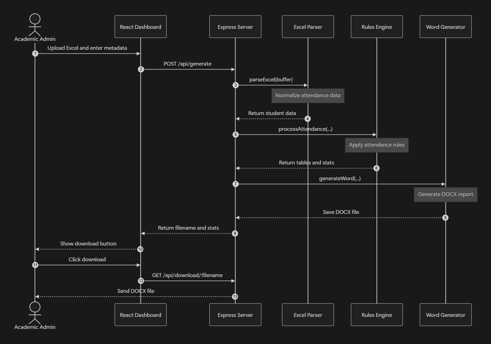

# RBU Detention Report Generator — Project Documentation

A comprehensive, full-stack solution for Ramdeobaba University (Nagpur) to automate attendance analysis and generate official academic detention documents.

---

## 1. Project Overview & Objective

The **RBU Detention Report Generator** is an automated academic administration utility. In universities, tracking and enforcing attendance guidelines manually is a slow and error-prone process. This project simplifies the workflow by allowing administrators to upload student attendance spreadsheets, input examination details, specify approved condonation applicants, and instantly receive a perfectly styled, university-compliant Word document (`.docx`) containing all required detention lists.

### Primary Purpose
1. **Automate Attendance Audit**: Standardize how student attendance lists are audited against academic regulations.
2. **Handle Complex Spreadsheet Layouts**: Parse Excel spreadsheets that include merged rows, empty spacing rows, and irregular "pouring attendance" data.
3. **Generate Official Reports**: Create a high-fidelity Microsoft Word document matching official Ramdeobaba University administrative layouts, complete with legal disclaimers, course/student splits, and signature lines.

---

## 2. Core Features

### 📂 Drag-and-Drop Excel Parsing
- Accept `.xls` and `.xlsx` uploads.
- Secure, memory-only file streaming (no temporary files saved to the backend disk).
- Smart row merging to handle students spanning 2–3 rows due to vertical merges in Excel (e.g., lecture vs. laboratory rows).

### ⚙️ Detention Rules Engine
The backend processes records against institutional rules:
- **Table I (Overall Detention)**: Captures students whose **Aggregate Overall Attendance** is strictly **below 75%**.
- **Table II (Condonation Recommended)**: Identifies students within the **60% to 74.99%** window who have been manually granted condonation by the administration.
- **Table III (A) (Course-wise Detention)**: Aggregates list of students who have **less than 60%** attendance in a specific course.
- **Table III (B) (Student-wise Detention)**: Cross-references course-wise detentions by student, displaying each student with all the courses they are detained in.

### 📝 Microsoft Word (.docx) Generator
- Programmatically constructs OpenXML Word files.
- Formats text using `Times New Roman`, proper heading hierarchies, color-coded cell headers (`#D9E1F2`), precise table column widths, and correct pagination.
- Includes official phrasing (e.g., *"Submitted to Vice-Chancellor for Approval..."*) and dual H.O.D / Dean signature blocks.

### 📊 Real-Time Admin Dashboard
- Clean, responsive layout.
- Immediate statistical summary (Total Students, Table I count, Table II count, Detained Students) upon generation.
- Instant, secure download link for the generated report.

---

## 3. Tech Stack

### Frontend (Client-side)
*   **React 18 & Vite**: For rendering a fast, single-page application with hot module replacement (HMR).
*   **Tailwind CSS**: Modern utility-first CSS styling for a responsive, clean, and professional admin UI.
*   **Axios**: For managing multipart/form-data POST requests to upload file buffers and metadata.

### Backend (Server-side)
*   **Node.js & Express**: High-concurrency runtime environment and REST API router.
*   **Multer (Memory Storage)**: Processes file uploads into memory buffers rather than disk files, reducing I/O latency and security risks.
*   **SheetJS (XLSX)**: Parses raw binary spreadsheet buffers into clean JSON/Array representations.
*   **docx (npm package)**: Programmatic layout builder used to generate beautiful, formatted Word documents.

---

## 4. File-by-File Analysis

Here is the breakdown of how every file works and what its role is in the system.

### ── System Directory Tree ──
```
attendance-system/
├── client/                     ← React Frontend
│   ├── src/
│   │   ├── services/
│   │   │   └── api.js          ← API calling utility (Axios client)
│   │   ├── App.jsx             ← Primary Admin UI and state container
│   │   ├── index.css           ← Tailwinds CSS entrypoint
│   │   └── main.jsx            ← React DOM mounting entrypoint
│   └── package.json            ← Client configuration and dependencies
└── server/                     ← Node.js Backend
    ├── server.js               ← Main backend server entry point
    ├── routes/
    │   └── reportRoutes.js     ← Upload and download API route definitions
    ├── controllers/
    │   └── reportController.js ← Orchestrates parser, processor, and docx generator
    ├── services/
    │   ├── excelParser.js      ← Robust parser for merged / messy Excel rows
    │   ├── attendanceProcessor.js ← Rule execution engine
    │   └── wordGenerator.js    ← Programmatic layout builder for .docx output
    └── package.json            ← Server configuration and dependencies
```

---

### 📂 Client Files (Frontend)

#### 1. [client/src/services/api.js](file:///c:/Users/lalit/OneDrive/Desktop/Projects/attendance-system/client/src/services/api.js)
*   **Purpose**: Manages communication with the Node.js backend.
*   **Working**:
    *   Creates an Axios instance pointing to the base path `/api`.
    *   Exports `generateReport(formData)` which submits the spreadsheet and metadata using the `multipart/form-data` header.
    *   Exports `getDownloadUrl(filename)` to fetch the download URL for the generated `.docx` file.

#### 2. [client/src/App.jsx](file:///c:/Users/lalit/OneDrive/Desktop/Projects/attendance-system/client/src/App.jsx)
*   **Purpose**: The central user interface of the application.
*   **Working**:
    *   **State Management**: Tracks selected file, drag-and-drop state, inputs (Exam Name, Semester, etc.), loading states, validation errors, and the final response object.
    *   **Drag-and-Drop Area**: Handcrafted drop-zone with file type validations (allows only `.xls` / `.xlsx`).
    *   **Forms**: Collects text/date fields and comma-separated lists of seat numbers for condonation.
    *   **Stat Cards & Feedback**: Once generated, displays immediate counts of detained students and exports a download button linking to the generated document.

#### 3. [client/src/main.jsx](file:///c:/Users/lalit/OneDrive/Desktop/Projects/attendance-system/client/src/main.jsx)
*   **Purpose**: Renders the React root application inside the DOM.

#### 4. [client/src/index.css](file:///c:/Users/lalit/OneDrive/Desktop/Projects/attendance-system/client/src/index.css)
*   **Purpose**: Imports Tailwind CSS layers.

---

### 📂 Server Files (Backend)

#### 5. [server/server.js](file:///c:/Users/lalit/OneDrive/Desktop/Projects/attendance-system/server/server.js)
*   **Purpose**: The startup and middleware entry point of the server.
*   **Working**:
    *   Initializes the Express app on port `5000` (or `process.env.PORT`).
    *   Assures the existence of a `./generated` subdirectory to save produced reports.
    *   Applies standard middlewares: CORS, JSON parsing, URL encoding.
    *   Attaches the `/api` route prefix to `reportRoutes.js` and provides a `/health` endpoint.
    *   Implements a global error-handling fallback middleware.

#### 6. [server/routes/reportRoutes.js](file:///c:/Users/lalit/OneDrive/Desktop/Projects/attendance-system/server/routes/reportRoutes.js)
*   **Purpose**: Route declarations and file upload pre-processing.
*   **Working**:
    *   Sets up **Multer** in memory storage mode to process the Excel sheet safely without filling up local server disk space.
    *   Applies a file filter to reject any file that is not `.xls` or `.xlsx`.
    *   Binds:
        *   `POST /api/generate` to the controller's report generation process.
        *   `GET /api/download/:filename` to the controller's download server.

#### 7. [server/controllers/reportController.js](file:///c:/Users/lalit/OneDrive/Desktop/Projects/attendance-system/server/controllers/reportController.js)
*   **Purpose**: The central conductor of the backend logic.
*   **Working**:
    *   Validates input metadata (checks if Exam Name, School, Semester, and Date are present).
    *   Splits and parses the optional comma-separated list of Condonation Seat Numbers into a standard ES6 `Set` for instant lookup times.
    *   Runs the request through a 3-step pipeline:
        1.  Calls `excelParser.js` to extract students and subject headers.
        2.  Passes this parsed data along with the condonation list to `attendanceProcessor.js` to compute the datasets.
        3.  Passes the datasets to `wordGenerator.js` along with the metadata to compile the final `.docx` file in `./generated`.
    *   Sends a response JSON back containing statistical counts and the target filename.
    *   Includes a secure `downloadReport` handler with basic security checks to block path-traversal exploits.

#### 8. [server/services/excelParser.js](file:///c:/Users/lalit/OneDrive/Desktop/Projects/attendance-system/server/services/excelParser.js)
*   **Purpose**: Converts messy RBU academic spreadsheets into structured JS arrays.
*   **Working**:
    *   **Spreadsheet Parsing**: Uses `xlsx` to parse the file buffer without header inference (reads as arrays of raw rows).
    *   **Header Mapping**: Maps indices: column `0` is Roll Number, `2` is Seat Number, `3` is Student Name, `4` is Aggregate Attendance, and everything from column `5` onwards is considered a subject.
    *   **RegEx Percentage Extraction**: Extracts raw percentages from messy cells via Regex:
        *   Standard cells like `"10 / 24 ( 41.67 % )"` yield `41.67`.
        *   Pouring cells like `"pouring Attendance :28.0/ 33 (84.85)"` yield `84.85`.
        *   Overall aggregate cells like `"134/256 (52.34)"` yield `52.34`.
    *   **Merged Row Reconciliation**: When a student spans multiple rows, the parser groups all consecutive rows belonging to that student and merges their subject attendance, preferring high-quality values (e.g. the first row) and fallback values in consecutive rows.

#### 9. [server/services/attendanceProcessor.js](file:///c:/Users/lalit/OneDrive/Desktop/Projects/attendance-system/server/services/attendanceProcessor.js)
*   **Purpose**: Applies mathematical rules to sort students into the correct detention tables.
*   **Working**:
    *   **Threshold Constants**:
        *   `OVERALL_THRESHOLD = 75` (detention overall if aggregate < 75%)
        *   `CONDONATION_MIN = 60` (condonation window lower bound is 60%)
        *   `SUBJECT_THRESHOLD = 60` (detained in a course if its attendance < 60%)
    *   **Table Sort Logic**:
        *   Loops over normalized student records.
        *   If `overallPct < 75`, adds them to **Table I**.
        *   If `60 <= overallPct < 75` AND the student's seat number is present in the `condonationSeats` Set, adds them to **Table II**.
        *   Loops over all subjects. If a subject's score is `< 60`, adds the entry to **Table III(A)** (course-wise list) and also aggregates this under the student's name in **Table III(B)** (student-wise list).
    *   Calculates total metadata stats (number of detained courses, students, and tables).

#### 10. [server/services/wordGenerator.js](file:///c:/Users/lalit/OneDrive/Desktop/Projects/attendance-system/server/services/wordGenerator.js)
*   **Purpose**: Programmatic MS Word layout engine.
*   **Working**:
    *   Uses the OpenXML-based `docx` builder.
    *   **Styling Standards**:
        *   Font: Defaults to 10pt (size 20 in docx) or 9.5pt (size 19) **Times New Roman** for headers and bodies.
        *   Margins: Configures a standard 1.5 inch top/bottom/left/right border for clean spacing.
    *   **Component Builders**:
        *   `headerCell(text, width)`: Draws gray-shaded (`#D9E1F2`) table headers with bold centered text.
        *   `dataCell(text, width, alignment)`: Draws standard white data cells with customized text alignment.
        *   `buildTableI(rows)`, `buildTableII(rows)`, `buildTableIIIA(courses)`, and `buildTableIIIB(students)`: Constructs the four custom tables with precise column-width matrices summing to A4 layout width (`9026 DXA` twips).
    *   **Document Generation**:
        *   Appends the title, sub-titles, date, school, program, and semester.
        *   Appends explanatory texts detailing the legal/academic rules for each table.
        *   Sequentially renders and inserts all 4 tables.
        *   Appends H.O.D. and Dean signature lines side-by-side using tabular layout alignment.
        *   Outputs a binary buffer to be saved securely onto the filesystem.

---

## 5. Summary of how the Features Work Together



